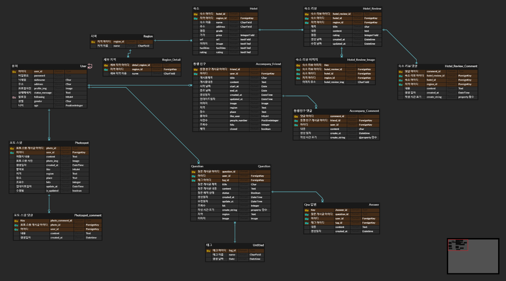
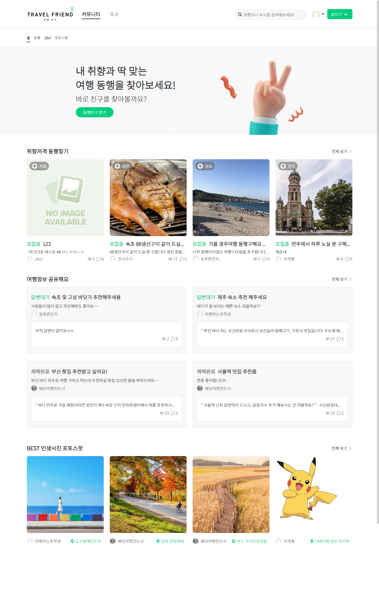
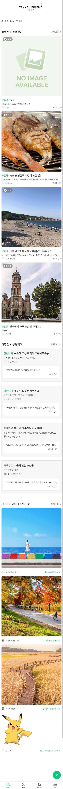
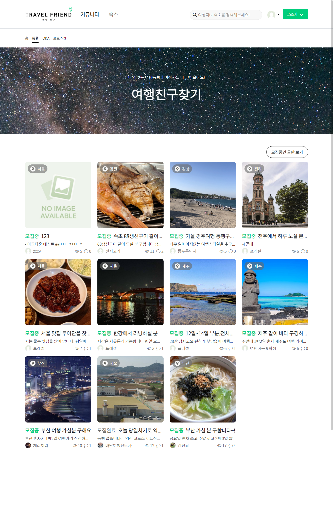
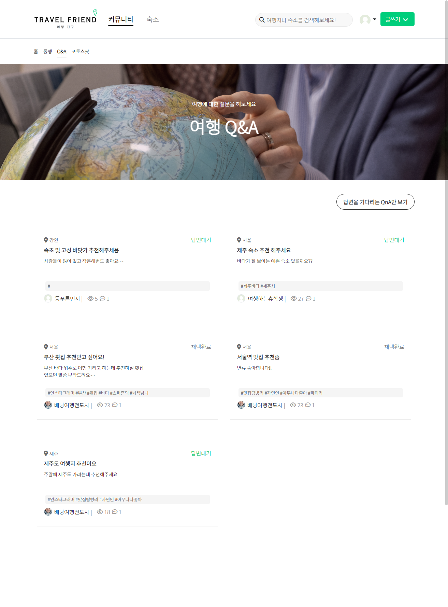
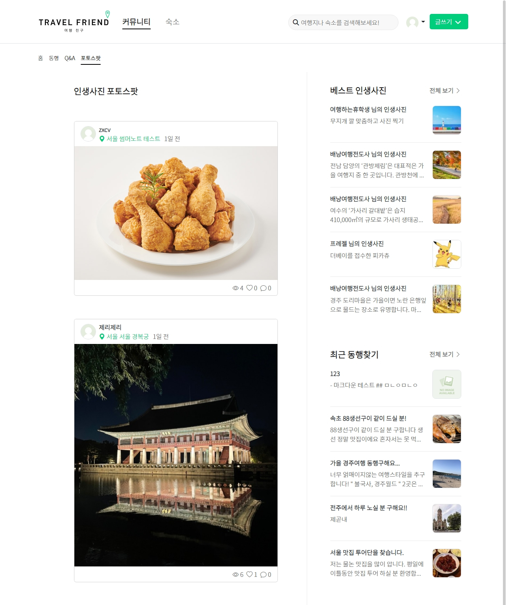
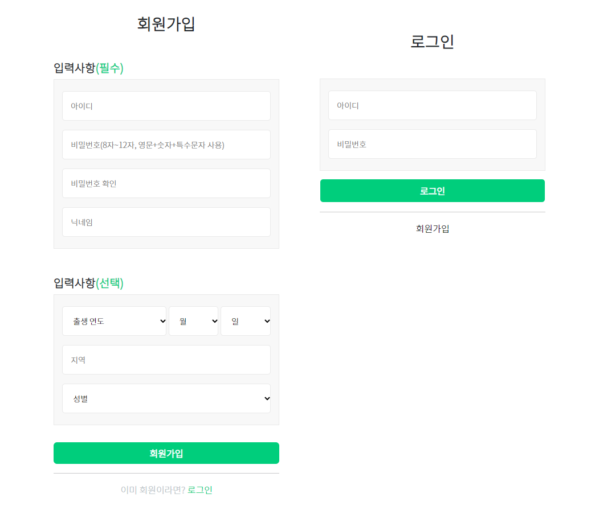
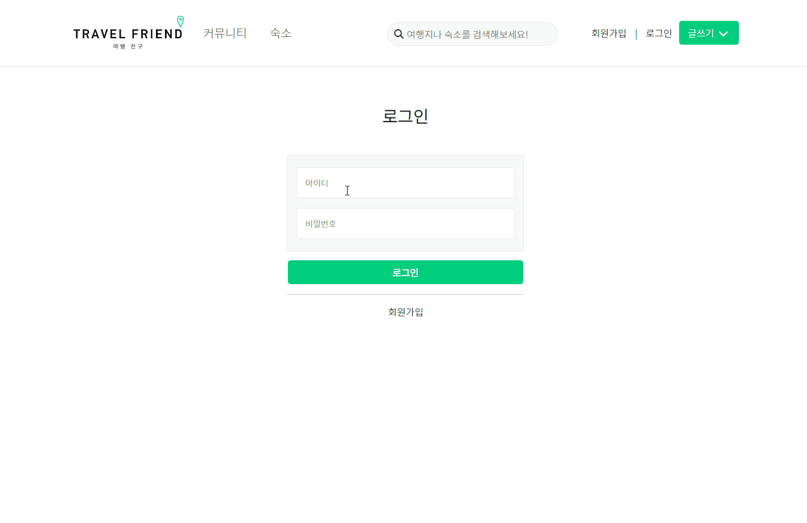

# ✈여(행)친(구) 프로젝트

### 팀원 소개

---

| 팀원   | 담당       | 비고                           |
| ------ | ---------- | ------------------------------ |
| 김나형 | FE         | qna/accounts/nav  담당 및 팀장 |
| 김선교 | Full stack |                                |
| 이성훈 | BE         |                                |
| 최민아 | FE         |                                |
| 하두연 | BE         |                                |

 
팀원 개인깃헙

    
 
		
            
            <a href="https://github.com/na-hyeong9">김나형 깃허브</a>		
        

        

            <a href="https://github.com/knuksg">김선교 깃허브</a>			
        

        

            <a href="https://github.com/danny7128">이성훈 깃허브</a>
        

		

       		<a href=" https://github.com/ccmmaa1030">최민아 깃허브</a>
        

        

       		<a href=" https://github.com/hady1024">하두연 깃허브</a>
        

    

​        

### 활용한 기술 스택

<h1>📚 STACKS</h1>

    
   
	
	
	
	
	
	
	
	
	

### Link

---

<a href="https://github.com/na-hyeong9/PJT_yeochin/pulls?page=2&q=is%3Apr+is%3Aclosed">

### 기획

---

__`프로젝트 기간`__ 11.09 (수) ~ 11.21 (월)

#### 서비스 주요기능

- 동행 친구 (main) 

  - 동행친구 찾기 - 지역/일정/인원수
  - 모집중/ 모집 완료 필터

- 여행지 추천 Q&A - 지역/제목/콘텐츠/태그

  - 해시태그
  - 답변 대기/ 채택 완료 필터

- 숙소

  - 크롤링을 통한 숙소 목록 제공
  - 검색(숙소만 검색 가능)
  - 숙소 후기 (써머노트 활용)

- 마이페이지

  - 내 동행 게시물 목록/ 좋아요한 글 목록/ 포토스팟 목록 (각 게시물 detail로 연결)

  - 계정 관리(사용자 소개/ 비밀번호 변경/ 회원 탈퇴)
  - 팔로우 팔로잉

- 검색

  - 네브바에서 검색시 각 카테고리 별 검색 결과 보여주기
  - 동행친구 - 유저/여행지/일정 검색
  - 여행지 정보 - 여행지
  - 여행지 추천
  - 숙소

- 포토스팟

  - 여행지별 장소 제공
  - 포토스팟 인기 게시물
  - 최신 동행글 미리보기

#### ERD

#### 피그마 화면 설계

첨부 자료

[프로젝트 기획 노션](https://www.notion.so/hg-edu/3b88bc6cd8da42a1b5b7f737d855adc6)

### 웹 사이트 구현

#### 메인

> 메인페이지 (반응형)

​	모바일 사이즈 화면에서는 네브바가 하단에 fix되어 있습니다.

​	 모든 게시물이 반응형으로 처리 되었습니다.

#### 동행친구 찾기

> 여행에 함께하는 친구를 찾을 수 있는 게시판입니다.

#### 여행 QnA

> 여행 관련 질문을 하고 답하는 여행 정보 공유 게시판입니다.

#### 포토스팟

> 여행지에 가면 어떤 곳에서 사진을 찍을 수 있을까?
>
> 고민을 덜어드릴 수 있는 인생 사진 명소 공유 게시판입니다.

#### 숙소

> 숙소에 대한 정보와 리뷰 그리고 검색 기능을 구현하였습니다.

#### 회원 관련 페이지

> 회원가입과 로그인 페이지 입니다.

> 마이페이지에서 정보 확인 및 수정이 가능합니다.

### 데일리 스크럼

 
11.10 스크럼 일지

    

         
프로젝트 기획 보완 
base.html (navbar) 
accounts (user) model 
articles (동행 친구) model 
photospots (photospot) model 
    

 
11.11 스크럼 일지

    

         
        <b>김나형</b>  
        base.html 보완 
		QnA model/view  
        <b>김선교</b>  
        검색 model 및 호텔 mtv 진행중  
        <b>이성훈</b>  
        friend 카테고리에 user foreign key 넣기 
		댓글에 유저 이미지 불러오기 
		index와 detail에 유저 프로필 사진 추가 
		index에서 content 20자 넘어가면 …표시 
		좋아요 기능구현(동기) 
        <b>최민아</b>  
    	Photospot 피그마 레이아웃 배치
		detail 댓글 추가 
		비동기 좋아요 view 오류 수정  
        <b>하두연</b>  
        유저기능보완  
    

 
11.14 스크럼 일지

    

         
        <b>김나형</b>  
        소셜로그인 기능 구현 보완  
        <b>김선교</b>  
        호텔 템플릿 수정  
        <b>이성훈</b>  
        Friend 탬플릿 수정 
		index에서 title 20자 넘어가면 …표시 
		목적지 hover시 시작일자~끝일자 나타내기 
		Friend home추가   
        <b>최민아</b>  
        포토스팟 게시글 조회수 추가 
		포토스팟 게시글 작성시간대(방금전…등) 추가 
		템플릿 수정 
    	Photospot 피그마 레이아웃 배치  
        <b>하두연</b>  
    	마이페이지 보완(내 게시글, 좋아요글 모아보기)  
	

 
11.15 스크럼 일지

    

        <b>김나형</b>  
        소셜로그인 (카카오로 로그인 전환 화면 확인) 
		base.html 푸터 
        QnA 모델 수정  
        <b>김선교</b>  
    	댓글 좋아요 비동기 구현  
        <b>이성훈</b>  
		Friend 템플릿 수정 
		장소와 인원수 모델 추가 
		<b>최민아</b>  
		Photospot 베스트 게시판 (url,view, tamplate) 
		photospots 전체 템플릿 다듬기  
		<b>하두연</b>  
        mtpage 내 게시글, 좋아요 글 모아보기
    

 
11.16 스크럼 일지

    

        <b>김나형</b>  
        QnA 템플릿 전체  
        <b>김선교</b>  
    	백엔드 전반  
        <b>이성훈</b>  
		Friend 템플릿 수정 
		조회수 구현 
        동행친구 링크 추가 
        프로필 정모 (나이,성별)  
		<b>최민아</b>  
		글쓰기 버튼 반응형 배치 
        photospot form.html 템플릿 수정 
		푸터 (프로젝트, 팀 정보)추가  
		<b>하두연</b>  
        내 게시글, 좋아요 글 모아보기 수정 
        user detail.html 수정
    

 
11.17 스크럼 일지

    

        <b>김나형</b>  
        qna index 디자인 
		지역 카테고리 기능 (form)  
        <b>김선교</b>  
    	채팅 기능 다른 앱에 적용  
        <b>이성훈</b>  
		Friend 템플릿 수정 
        모집기능 추가 
        프로필 정모 (나이,성별)  
		<b>최민아</b>  
		navbar(header) 수정 - 로고 이미지, 링크 
        동행친구 navbar(second) 수정 - fixed 
        qna detail 반응형 배치 수정 
		friends detail 반응형 배치 수정  
		<b>하두연</b>  
        내 게시글, 좋아요 글 모아보기 수정 
        user detail.html 수정
    

    
11.18 스크럼 일지

    

        <b>김나형</b>  
        qna js쪽 디자인 디테일 필요 
		qna 태그 (form, index에 추가) 
		form 수정 오류 디버깅  
         <b>김선교</b>  
		AWS 배포 완료 및 추가 기능 확인  
    	<b>이성훈</b>  
		Friend 탬플릿 수정 
		프로필 정보(나이,성별)추가 
		모집기능 추가  
        <b>최민아</b>  
		커뮤니티(동행친구, qna, 포토스팟) home 템플릿 
		채팅방 생성 form 템플릿 
		개별 채팅방 템플릿  
        <b>하두연</b>  
		마이페이지 내 게시글 좋아요 포토스팟 모아보기 기능
	

    
11.21 스크럼 일지

    

        <b>김나형</b>  
		chats(생성, 목록, 개별채팅방) 템플릿 수정 
		index 오류 재확인 
        Qna/동행친구 찾기 배너 생성 
		발자국 정리  
        <b>김선교</b>  
		백엔드 전반  
    	<b>이성훈</b>  
		image모델 정리(thumbnail삭제) 
		사람수에 0이상의 수만 들어가게 수정 
		기능 정상작동 점검  
        <b>최민아</b>  
		chats(생성, 목록, 개별채팅방) 템플릿 수정 
		photospots 지역 추가 
		ppt 만들기  
        <b>하두연</b>  
		mypage css 수정
	

### 프로젝트를 마치며

> KTP 회고

1. Keep

   - 팀원들중 한명에게 문제가 생겼을 때 다같이 해결법을 찾는것이 좋았습니다.
   - 초반에 피그마로 기획한 대로 화면 구성이 잘 나온 것 같아서 만족스러웠습니다.

   

2. Problem

   - 배포 후 채팅기능을 사용하지 못해서 아쉬움

   - 바뀐 모델을 마이그레이션 할 때 변화가 감지가 안돼서 db자체를 지우고 다시 만드느라 시간을 많이 소비함
   - 배포 과정이 어려웠습니다.
   - 소셜 로그인 마무리가 안되어서 아쉬움이 남았습니다.

   

3. Try

   - 소셜 로그인 구현을 팀원들이 함께 고민을 해봐도 어려웠는데, 다음에는 api 문서를 좀 더 잘 이해한 후에 진행해보면 좋을 것 같습니다.

   - 채팅 서버 배포에 관한 가이드들을 찾아봤는데, 기초부터 모르니 잘 이해할 수 없었습니다.

     

> 남기고 싶은 말

- 아쉬운 점이 남았지만 좋은 팀원분들을 만나서 배포까지 무사히 끝낼 수 있었습니다. 다음 프로젝트와 취업까지 좋게 마무리하면 좋겠습니다.
- 이번 프로젝트도 기분 좋게 끝난 것 같습니다. 다들 너무 감사하고, 앞으로도 화이팅입니다!
- 모르는게 많아서 최소 1머지 1질문을 했었는데 친절하게 알려주셔서 감사했고 마지막 프로젝트도 힘내서 끝내면 좋을것 같습니다!

